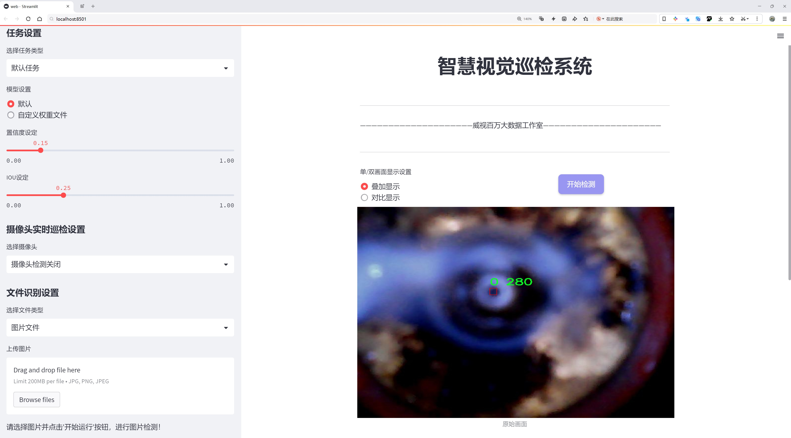
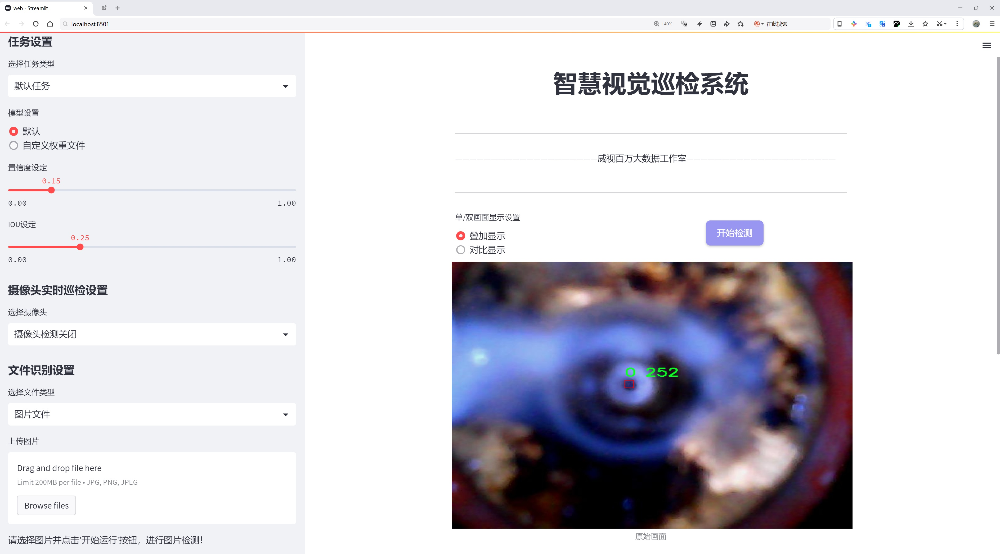
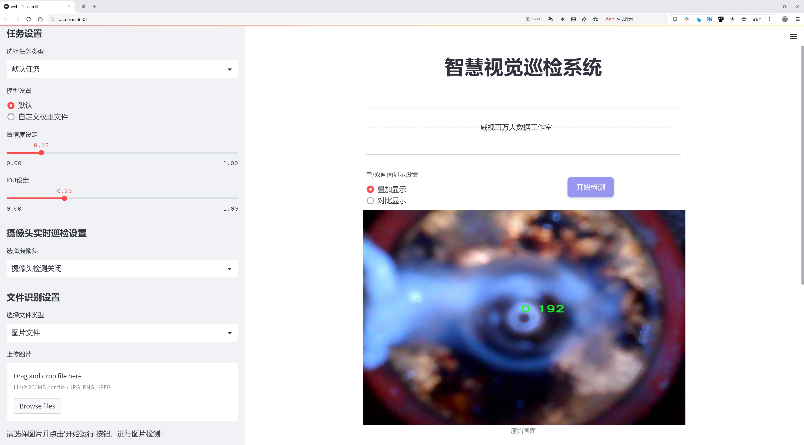
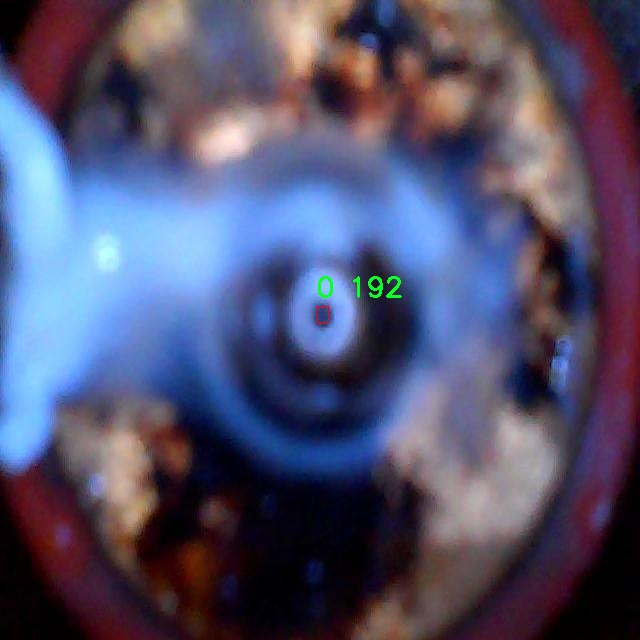
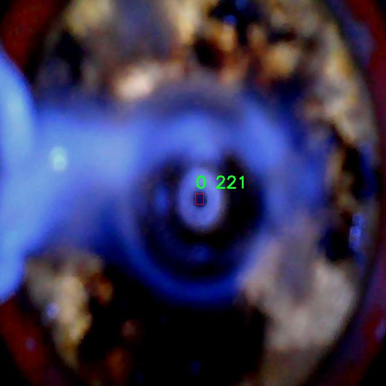
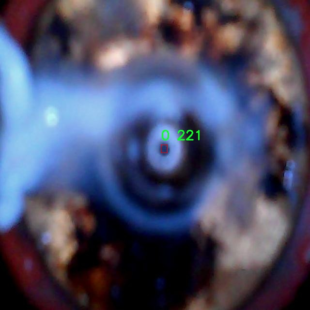
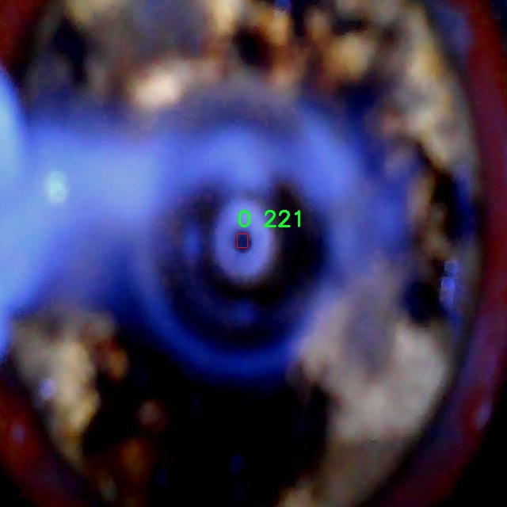

# 喷嘴检测检测系统源码分享
 # [一条龙教学YOLOV8标注好的数据集一键训练_70+全套改进创新点发刊_Web前端展示]

### 1.研究背景与意义

项目参考[AAAI Association for the Advancement of Artificial Intelligence](https://gitee.com/qunmasj/projects)

项目来源[AACV Association for the Advancement of Computer Vision](https://kdocs.cn/l/cszuIiCKVNis)

研究背景与意义

喷嘴作为工业生产和科学实验中不可或缺的组件，其性能直接影响到流体的喷射效果、分布均匀性以及最终产品的质量。因此，喷嘴的检测与监控在现代制造业和自动化系统中显得尤为重要。传统的喷嘴检测方法多依赖于人工视觉检查或简单的图像处理技术，这些方法不仅效率低下，而且容易受到人为因素的影响，导致检测结果的不稳定性和不准确性。随着计算机视觉和深度学习技术的迅猛发展，基于图像的自动化检测系统逐渐成为研究的热点。

在众多的目标检测算法中，YOLO（You Only Look Once）系列因其高效性和实时性而受到广泛关注。YOLOv8作为该系列的最新版本，结合了多种先进的深度学习技术，具备了更强的特征提取能力和更快的推理速度，能够在复杂环境中实现高精度的目标检测。然而，尽管YOLOv8在多种应用场景中表现出色，但在特定领域如喷嘴检测中，仍然存在一定的局限性。因此，针对喷嘴检测的特点，对YOLOv8进行改进和优化，将是提升检测精度和效率的关键。

本研究旨在基于改进的YOLOv8模型，构建一个高效的喷嘴检测系统。为此，我们将使用一个包含2800张图像的数据集，该数据集包含两类喷嘴（类0和类1），为模型的训练和验证提供了丰富的样本。这一数据集的构建，不仅为喷嘴检测提供了基础数据支持，也为后续的算法优化和模型评估奠定了基础。通过对该数据集的深入分析，我们可以识别出喷嘴在不同工作状态下的特征，从而为模型的改进提供数据依据。

改进YOLOv8的喷嘴检测系统，不仅能够提高喷嘴的检测精度和速度，还能够实现对喷嘴状态的实时监控，及时发现潜在的故障和问题。这对于提升生产效率、降低维护成本、保障产品质量具有重要的实际意义。此外，基于深度学习的喷嘴检测系统还可以与其他智能制造系统相结合，形成完整的工业4.0解决方案，推动制造业的数字化转型。

综上所述，本研究不仅具有重要的理论价值，也具备显著的应用前景。通过对YOLOv8的改进，我们期望能够在喷嘴检测领域实现更高的自动化水平，为相关行业提供更为精准和高效的检测解决方案。这一研究将为未来的智能制造和工业自动化提供有力的技术支持，推动相关领域的持续发展与创新。

### 2.图片演示







##### 注意：由于此博客编辑较早，上面“2.图片演示”和“3.视频演示”展示的系统图片或者视频可能为老版本，新版本在老版本的基础上升级如下：（实际效果以升级的新版本为准）

  （1）适配了YOLOV8的“目标检测”模型和“实例分割”模型，通过加载相应的权重（.pt）文件即可自适应加载模型。

  （2）支持“图片识别”、“视频识别”、“摄像头实时识别”三种识别模式。

  （3）支持“图片识别”、“视频识别”、“摄像头实时识别”三种识别结果保存导出，解决手动导出（容易卡顿出现爆内存）存在的问题，识别完自动保存结果并导出到tempDir中。

  （4）支持Web前端系统中的标题、背景图等自定义修改，后面提供修改教程。

  另外本项目提供训练的数据集和训练教程,暂不提供权重文件（best.pt）,需要您按照教程进行训练后实现图片演示和Web前端界面演示的效果。

### 3.视频演示

[3.1 视频演示](https://www.bilibili.com/video/BV1aCtCe6Ee9/)

### 4.数据集信息展示

##### 4.1 本项目数据集详细数据（类别数＆类别名）

nc: 2
names: ['0', '1']


##### 4.2 本项目数据集信息介绍

数据集信息展示

在本研究中，我们采用了名为“Nozzle Detection”的数据集，以训练和改进YOLOv8模型在喷嘴检测系统中的表现。该数据集专门针对喷嘴的识别与分类任务，包含了丰富的图像数据，旨在提高计算机视觉算法在工业应用中的准确性和效率。数据集的设计充分考虑了喷嘴在不同环境和条件下的表现，确保模型能够在多样化的场景中保持良好的识别能力。

“Nozzle Detection”数据集包含两个主要类别，分别标记为“0”和“1”。这些类别的划分不仅反映了喷嘴的不同类型或状态，还为模型的训练提供了清晰的目标，使得YOLOv8能够在学习过程中更好地理解和区分这些喷嘴的特征。类别“0”可能代表一种特定类型的喷嘴，例如常见的工业喷嘴，而类别“1”则可能对应于另一种设计或功能的喷嘴，如高压喷嘴或特定用途的喷嘴。这种分类方式为后续的模型评估和性能优化提供了基础。

数据集中的图像样本涵盖了多种拍摄角度、光照条件和背景环境，确保了训练数据的多样性和代表性。通过这种多样化的样本，YOLOv8能够学习到喷嘴在不同条件下的外观特征，从而提高其在实际应用中的鲁棒性。例如，数据集中可能包含在工厂环境、实验室设置或户外场景中拍摄的喷嘴图像，这样的设计使得模型能够适应不同的工作场景。

此外，数据集的标注过程经过严格的质量控制，确保每个图像中的喷嘴都被准确地标记和分类。这一过程不仅提高了数据集的可靠性，也为模型的训练提供了高质量的监督信号。通过精确的标注，YOLOv8能够在训练过程中有效地学习到喷嘴的边界框和类别信息，从而在推理阶段实现高效的检测和分类。

在模型训练过程中，我们将利用数据集中的图像进行增强处理，以进一步提升模型的泛化能力。这包括对图像进行旋转、缩放、裁剪以及颜色调整等操作，以模拟不同的拍摄条件和环境变化。通过这种数据增强策略，我们希望能够提升YOLOv8在喷嘴检测任务中的表现，使其在面对未见过的图像时仍能保持高准确率。

总之，“Nozzle Detection”数据集为改进YOLOv8的喷嘴检测系统提供了坚实的基础。通过对喷嘴类别的明确划分、丰富的样本多样性以及高质量的标注，该数据集不仅有助于提升模型的学习效果，也为实际应用中的喷嘴检测提供了可靠的技术支持。未来，我们将继续优化模型，并探索更多的数据集特性，以实现更高效的喷嘴检测解决方案。










### 5.全套项目环境部署视频教程（零基础手把手教学）

[5.1 环境部署教程链接（零基础手把手教学）](https://www.ixigua.com/7404473917358506534?logTag=c807d0cbc21c0ef59de5)


[5.2 安装Python虚拟环境创建和依赖库安装视频教程链接（零基础手把手教学）](https://www.ixigua.com/7404474678003106304?logTag=1f1041108cd1f708b01a)

### 6.手把手YOLOV8训练视频教程（零基础小白有手就能学会）

[6.1 手把手YOLOV8训练视频教程（零基础小白有手就能学会）](https://www.ixigua.com/7404477157818401292?logTag=d31a2dfd1983c9668658)

### 7.70+种全套YOLOV8创新点代码加载调参视频教程（一键加载写好的改进模型的配置文件）

[7.1 70+种全套YOLOV8创新点代码加载调参视频教程（一键加载写好的改进模型的配置文件）](https://www.ixigua.com/7404478314661806627?logTag=29066f8288e3f4eea3a4)

### 8.70+种全套YOLOV8创新点原理讲解（非科班也可以轻松写刊发刊，V10版本正在科研待更新）

由于篇幅限制，每个创新点的具体原理讲解就不一一展开，具体见下列网址中的创新点对应子项目的技术原理博客网址【Blog】：


[8.1 70+种全套YOLOV8创新点原理讲解链接](https://gitee.com/qunmasj/good)

### 9.系统功能展示（检测对象为举例，实际内容以本项目数据集为准）

图9.1.系统支持检测结果表格显示

  图9.2.系统支持置信度和IOU阈值手动调节

  图9.3.系统支持自定义加载权重文件best.pt(需要你通过步骤5中训练获得)

  图9.4.系统支持摄像头实时识别

  图9.5.系统支持图片识别

  图9.6.系统支持视频识别

  图9.7.系统支持识别结果文件自动保存

  图9.8.系统支持Excel导出检测结果数据


### 10.原始YOLOV8算法原理

原始YOLOv8算法原理

YOLOv8是由Ultralytics公司于2023年推出的最新一代目标检测算法，作为YOLO系列的最新作品，它在检测精度和速度上都实现了显著的提升。YOLOv8系列包括多个不同规模的模型，如YOLOv8n、YOLOv8s、YOLOv8m等，其中YOLOv8n因其参数量最小且检测速度最快而备受关注。本文将重点探讨YOLOv8n的核心原理和创新设计。

YOLOv8的网络结构主要分为四个部分：输入端、主干网络、颈部网络和头部网络。输入端通过多种数据增强技术（如马赛克增强）和自适应锚框计算，确保输入图像的多样性和适应性。马赛克增强技术通过将多张图像拼接在一起，生成更为复杂的训练样本，从而提高模型的鲁棒性。此外，自适应锚框计算和灰度填充的引入，进一步优化了输入数据的处理方式，使得模型能够更好地适应不同场景和光照条件下的目标检测任务。

在主干网络部分，YOLOv8n采用了CSP（Cross Stage Partial）结构和C2f（C2 Feature）模块，这一设计旨在增强特征提取的能力。C2f模块通过引入更多的分支和跨层连接，形成了更为丰富的梯度流，从而提升了特征表示的能力。这种结构的引入，使得YOLOv8n在特征学习上更加高效，能够更好地捕捉到图像中的重要信息。此外，SPPF（Spatial Pyramid Pooling Fusion）模块的使用，进一步提高了模型的计算速度，使得YOLOv8n在实时检测中表现出色。

颈部网络采用了路径聚合网络（PAN-FPN）结构，这一设计旨在增强不同尺度特征的融合能力。PAN结构通过上下采样和特征拼接，能够有效地整合来自不同层次的特征信息，从而提高模型对多尺度目标的检测能力。这一特性在处理复杂场景和多样化目标时尤为重要，使得YOLOv8n能够在各种应用场景中保持高效的检测性能。

头部网络则是YOLOv8n的一大创新之处。与以往的耦合头结构不同，YOLOv8n采用了解耦头结构，将分类和检测过程分开进行。这一设计不仅提高了模型的灵活性，还使得损失计算过程更加高效。具体而言，YOLOv8n在损失计算中引入了Task-Aligned Assigner策略，通过对分类和回归分数的加权结果进行正样本匹配，确保了模型在训练过程中的有效性。分类分支采用了二元交叉熵损失（BCELoss），而回归分支则结合了分布焦点损失（DFLoss）和完全交并比损失（CIOULoss），以提升模型对边界框预测的精准性。

YOLOv8的另一个显著改进是其检测方式的转变，从传统的Anchor-Based方法转向Anchor-Free检测。这一转变不仅减少了锚框预测的数量，还加速了非最大抑制（NMS）过程，使得模型在复杂场景下的检测速度得到了显著提升。Anchor-Free方法的引入，使得YOLOv8在处理小目标和复杂背景时，能够更好地保持检测精度。

尽管YOLOv8在许多方面表现出色，但在某些复杂环境下，尤其是水面等背景多样的场景中，仍然存在定位误差和对小目标感知能力不足的问题。因此，针对这些不足，YOLOv8的改进版本，如YOLOv8-WSSOD，提出了一系列新的解决方案。通过引入BiFormer双层路由注意力机制，构建C2fBF模块，YOLOv8-WSSOD能够有效捕获远程依赖，保留特征提取过程中的细粒度上下文信息。此外，针对小目标漏检问题，改进版本还添加了更小的检测头，以提升网络对小目标的感知能力。

总的来说，YOLOv8的设计理念和结构创新，使其在目标检测领域展现出了卓越的性能。通过对传统YOLO系列的不断改进，YOLOv8不仅提升了检测精度和速度，还为未来的目标检测研究提供了新的思路和方向。随着YOLOv8及其改进版本的不断发展，目标检测技术将在更广泛的应用场景中发挥重要作用。


### 11.项目核心源码讲解（再也不用担心看不懂代码逻辑）

#### 11.1 70+种YOLOv8算法改进源码大全和调试加载训练教程（非必要）\ultralytics\models\nas\val.py

以下是对代码的核心部分进行的提炼和详细中文注释：

```python
# 导入必要的库
import torch
from ultralytics.models.yolo.detect import DetectionValidator
from ultralytics.utils import ops

class NASValidator(DetectionValidator):
    """
    Ultralytics YOLO NAS 验证器，用于目标检测。

    该类扩展了 Ultralytics 模型包中的 `DetectionValidator`，旨在对 YOLO NAS 模型生成的原始预测结果进行后处理。
    它执行非极大值抑制（NMS），以去除重叠和低置信度的框，最终生成最终检测结果。

    属性:
        args (Namespace): 包含各种后处理配置的命名空间，例如置信度和 IoU 阈值。
        lb (torch.Tensor): 可选的多标签 NMS 的张量。

    示例:
        ```python
        from ultralytics import NAS

        model = NAS('yolo_nas_s')
        validator = model.validator
        # 假设 raw_preds 可用
        final_preds = validator.postprocess(raw_preds)
        ```

    注意:
        该类通常不直接实例化，而是在 `NAS` 类内部使用。
    """

    def postprocess(self, preds_in):
        """对预测输出应用非极大值抑制（NMS）。"""
        # 将预测框从 xyxy 格式转换为 xywh 格式
        boxes = ops.xyxy2xywh(preds_in[0][0])
        
        # 将框和置信度合并，并调整维度顺序
        preds = torch.cat((boxes, preds_in[0][1]), -1).permute(0, 2, 1)
        
        # 应用非极大值抑制，返回最终的检测结果
        return ops.non_max_suppression(preds,
                                       self.args.conf,  # 置信度阈值
                                       self.args.iou,   # IoU 阈值
                                       labels=self.lb,  # 标签
                                       multi_label=False,  # 是否支持多标签
                                       agnostic=self.args.single_cls,  # 是否使用单类
                                       max_det=self.args.max_det,  # 最大检测框数量
                                       max_time_img=0.5)  # 每张图像的最大处理时间
```

### 代码分析
1. **类的定义**：`NASValidator` 继承自 `DetectionValidator`，用于处理 YOLO NAS 模型的输出。
2. **后处理方法**：`postprocess` 方法是核心功能，负责将模型的原始预测结果进行处理。
   - **坐标转换**：使用 `ops.xyxy2xywh` 将预测框从左上角和右下角的坐标（xyxy）转换为中心点和宽高的格式（xywh）。
   - **合并预测**：将框和对应的置信度合并为一个张量，并调整维度顺序，以便于后续处理。
   - **非极大值抑制**：调用 `ops.non_max_suppression` 方法，去除重叠和低置信度的框，最终返回有效的检测结果。

### 总结
该代码主要实现了 YOLO NAS 模型的预测结果后处理功能，通过非极大值抑制来提高检测的准确性和有效性。

这个文件是Ultralytics YOLO模型中的一个验证器类，名为`NASValidator`，用于处理YOLO NAS模型的目标检测结果。它继承自`DetectionValidator`类，主要功能是对YOLO NAS模型生成的原始预测结果进行后处理，特别是执行非极大值抑制（NMS），以去除重叠和低置信度的边界框，从而最终得到有效的检测结果。

在类的文档字符串中，详细描述了`NASValidator`的用途和工作原理。它的主要属性包括`args`，这是一个命名空间，包含了用于后处理的各种配置，例如置信度和IoU（交并比）阈值；还有`lb`，这是一个可选的张量，用于多标签NMS。

`postprocess`方法是该类的核心功能，它接受原始预测结果`preds_in`作为输入。首先，它通过`ops.xyxy2xywh`函数将预测的边界框坐标从xyxy格式转换为xywh格式。接着，将边界框和相应的置信度进行拼接，并调整维度顺序。最后，调用`ops.non_max_suppression`函数进行非极大值抑制，传入置信度阈值、IoU阈值等参数，以过滤掉冗余的检测结果。

文件中的示例代码展示了如何使用`NASValidator`。首先导入`NAS`类，然后实例化一个YOLO NAS模型，并获取其验证器。假设已经有了原始预测结果`raw_preds`，可以通过调用`validator.postprocess(raw_preds)`来获得最终的检测结果。

需要注意的是，`NASValidator`类通常不会被直接实例化，而是在`NAS`类内部使用。这种设计使得模型的使用更加简洁，用户只需关注模型的高层接口，而不必深入底层的验证和后处理逻辑。

#### 11.2 ui.py

以下是代码中最核心的部分，并附上详细的中文注释：

```python
import sys
import subprocess

def run_script(script_path):
    """
    使用当前 Python 环境运行指定的脚本。

    Args:
        script_path (str): 要运行的脚本路径

    Returns:
        None
    """
    # 获取当前 Python 解释器的路径
    python_path = sys.executable

    # 构建运行命令，使用 streamlit 运行指定的脚本
    command = f'"{python_path}" -m streamlit run "{script_path}"'

    # 执行命令，并等待其完成
    result = subprocess.run(command, shell=True)
    
    # 检查命令执行的返回码，如果不为0，表示执行出错
    if result.returncode != 0:
        print("脚本运行出错。")

# 实例化并运行应用
if __name__ == "__main__":
    # 指定要运行的脚本路径
    script_path = "web.py"  # 这里可以直接指定脚本名，假设它在当前目录下

    # 调用函数运行脚本
    run_script(script_path)
```

### 代码注释说明：
1. **导入模块**：
   - `sys`：用于获取当前 Python 解释器的路径。
   - `subprocess`：用于执行外部命令。

2. **`run_script` 函数**：
   - 该函数接收一个脚本路径作为参数，并使用当前 Python 环境运行该脚本。
   - `python_path = sys.executable`：获取当前 Python 解释器的完整路径。
   - `command`：构建一个命令字符串，用于运行 `streamlit` 并指定要执行的脚本。
   - `subprocess.run(command, shell=True)`：执行构建的命令，并等待其完成。
   - `result.returncode`：检查命令的返回码，如果返回码不为0，表示脚本运行出错，打印错误信息。

3. **主程序部分**：
   - `if __name__ == "__main__":`：确保只有在直接运行该脚本时才会执行以下代码。
   - `script_path = "web.py"`：指定要运行的脚本路径（这里假设脚本在当前目录下）。
   - `run_script(script_path)`：调用 `run_script` 函数来执行指定的脚本。

这个程序文件名为 `ui.py`，其主要功能是通过当前的 Python 环境运行一个指定的脚本。程序首先导入了必要的模块，包括 `sys`、`os` 和 `subprocess`，以及一个自定义模块 `QtFusion.path` 中的 `abs_path` 函数。

在程序中定义了一个名为 `run_script` 的函数，该函数接受一个参数 `script_path`，表示要运行的脚本的路径。函数内部首先获取当前 Python 解释器的路径，接着构建一个命令字符串，这个命令使用 `streamlit` 模块来运行指定的脚本。具体来说，命令的格式是 `"{python_path}" -m streamlit run "{script_path}"`，其中 `python_path` 是当前 Python 解释器的路径，`script_path` 是要运行的脚本路径。

然后，程序使用 `subprocess.run` 方法来执行这个命令，`shell=True` 参数表示在 shell 中执行命令。执行完命令后，程序检查返回的结果码，如果不为零，说明脚本运行出错，此时会打印出“脚本运行出错。”的提示信息。

在文件的最后部分，程序通过 `if __name__ == "__main__":` 判断是否是直接运行该脚本。如果是，程序会调用 `abs_path` 函数来获取 `web.py` 脚本的绝对路径，并将其传递给 `run_script` 函数，从而启动该脚本的运行。

总体来看，这个程序的功能是封装了一个简单的命令行工具，用于在当前 Python 环境中运行指定的 Streamlit 脚本，方便用户进行快速开发和测试。

#### 11.3 70+种YOLOv8算法改进源码大全和调试加载训练教程（非必要）\ultralytics\nn\backbone\SwinTransformer.py

以下是简化后的代码，保留了核心部分，并添加了详细的中文注释：

```python
import torch
import torch.nn as nn
import torch.nn.functional as F
import numpy as np

class Mlp(nn.Module):
    """ 多层感知机（MLP）模块。"""

    def __init__(self, in_features, hidden_features=None, out_features=None, act_layer=nn.GELU, drop=0.):
        super().__init__()
        out_features = out_features or in_features  # 输出特征数默认为输入特征数
        hidden_features = hidden_features or in_features  # 隐藏层特征数默认为输入特征数
        self.fc1 = nn.Linear(in_features, hidden_features)  # 第一层线性变换
        self.act = act_layer()  # 激活函数
        self.fc2 = nn.Linear(hidden_features, out_features)  # 第二层线性变换
        self.drop = nn.Dropout(drop)  # Dropout层

    def forward(self, x):
        """ 前向传播函数。"""
        x = self.fc1(x)  # 线性变换
        x = self.act(x)  # 激活
        x = self.drop(x)  # Dropout
        x = self.fc2(x)  # 线性变换
        x = self.drop(x)  # Dropout
        return x


class WindowAttention(nn.Module):
    """ 基于窗口的多头自注意力模块。"""

    def __init__(self, dim, window_size, num_heads, qkv_bias=True, attn_drop=0., proj_drop=0.):
        super().__init__()
        self.dim = dim  # 输入通道数
        self.window_size = window_size  # 窗口大小
        self.num_heads = num_heads  # 注意力头数
        head_dim = dim // num_heads  # 每个头的维度
        self.scale = head_dim ** -0.5  # 缩放因子

        # 定义相对位置偏置参数
        self.relative_position_bias_table = nn.Parameter(
            torch.zeros((2 * window_size[0] - 1) * (2 * window_size[1] - 1), num_heads))

        # 计算相对位置索引
        coords_h = torch.arange(self.window_size[0])
        coords_w = torch.arange(self.window_size[1])
        coords = torch.stack(torch.meshgrid([coords_h, coords_w]))  # 生成坐标网格
        coords_flatten = torch.flatten(coords, 1)  # 展平坐标
        relative_coords = coords_flatten[:, :, None] - coords_flatten[:, None, :]  # 计算相对坐标
        relative_coords = relative_coords.permute(1, 2, 0).contiguous()  # 重新排列维度
        relative_coords[:, :, 0] += self.window_size[0] - 1  # 偏移
        relative_coords[:, :, 1] += self.window_size[1] - 1
        relative_coords[:, :, 0] *= 2 * self.window_size[1] - 1
        self.relative_position_index = relative_coords.sum(-1)  # 计算相对位置索引

        self.qkv = nn.Linear(dim, dim * 3, bias=qkv_bias)  # 线性变换生成Q、K、V
        self.attn_drop = nn.Dropout(attn_drop)  # 注意力权重的Dropout
        self.proj = nn.Linear(dim, dim)  # 输出线性变换
        self.proj_drop = nn.Dropout(proj_drop)  # 输出的Dropout

    def forward(self, x, mask=None):
        """ 前向传播函数。"""
        B_, N, C = x.shape  # 获取输入的形状
        qkv = self.qkv(x).reshape(B_, N, 3, self.num_heads, C // self.num_heads).permute(2, 0, 3, 1, 4)
        q, k, v = qkv[0], qkv[1], qkv[2]  # 分离Q、K、V

        q = q * self.scale  # 缩放Q
        attn = (q @ k.transpose(-2, -1))  # 计算注意力权重

        # 添加相对位置偏置
        relative_position_bias = self.relative_position_bias_table[self.relative_position_index.view(-1)].view(
            self.window_size[0] * self.window_size[1], self.window_size[0] * self.window_size[1], -1)
        relative_position_bias = relative_position_bias.permute(2, 0, 1).contiguous()
        attn = attn + relative_position_bias.unsqueeze(0)

        if mask is not None:
            attn = attn + mask.unsqueeze(1).unsqueeze(0)  # 添加掩码
        attn = F.softmax(attn, dim=-1)  # 计算softmax

        attn = self.attn_drop(attn)  # Dropout
        x = (attn @ v).transpose(1, 2).reshape(B_, N, C)  # 加权求和
        x = self.proj(x)  # 输出线性变换
        x = self.proj_drop(x)  # Dropout
        return x


class SwinTransformer(nn.Module):
    """ Swin Transformer主干网络。"""

    def __init__(self, patch_size=4, in_chans=3, embed_dim=96, depths=[2, 2, 6, 2], num_heads=[3, 6, 12, 24]):
        super().__init__()
        self.patch_embed = PatchEmbed(patch_size=patch_size, in_chans=in_chans, embed_dim=embed_dim)  # 图像分块嵌入
        self.layers = nn.ModuleList()  # 存储各层

        # 构建各层
        for i_layer in range(len(depths)):
            layer = BasicLayer(
                dim=int(embed_dim * 2 ** i_layer),
                depth=depths[i_layer],
                num_heads=num_heads[i_layer],
                window_size=7)  # 窗口大小
            self.layers.append(layer)

    def forward(self, x):
        """ 前向传播函数。"""
        x = self.patch_embed(x)  # 图像分块嵌入
        for layer in self.layers:
            x = layer(x)  # 逐层前向传播
        return x

# PatchEmbed和BasicLayer的实现省略，但它们是必要的构建块
```

### 主要部分说明：
1. **Mlp**: 实现了一个简单的多层感知机，包含两个线性层和激活函数。
2. **WindowAttention**: 实现了窗口自注意力机制，支持相对位置偏置。
3. **SwinTransformer**: 主干网络，负责图像的分块嵌入和多层的堆叠。 

### 注意：
- 省略了一些类（如`PatchEmbed`和`BasicLayer`）的具体实现，您可以根据需要添加这些实现。
- 代码中的注释详细解释了每个模块的功能和参数。

该程序文件实现了Swin Transformer模型的各个组件，主要用于计算机视觉任务。首先，文件导入了必要的PyTorch库和一些辅助函数。接着，定义了多个类和函数，构成了Swin Transformer的核心结构。

首先，`Mlp`类实现了一个多层感知机（MLP），包含两个线性层和一个激活函数（默认为GELU），用于对输入特征进行处理。`window_partition`和`window_reverse`函数用于将输入特征划分为窗口和将窗口合并回原始形状，支持窗口内的自注意力计算。

`WindowAttention`类实现了基于窗口的多头自注意力机制，支持相对位置偏置。它的构造函数中定义了输入通道数、窗口大小、注意力头数等参数，并初始化了相对位置偏置表。`forward`方法实现了自注意力的计算过程，包括查询、键、值的计算和相对位置偏置的应用。

`SwinTransformerBlock`类则是Swin Transformer的基本构建块，包含一个窗口注意力层和一个MLP层。它支持窗口的循环移位，并在前向传播中处理输入特征。

`PatchMerging`类用于将特征图的补丁合并，以减少特征图的空间维度。`BasicLayer`类则是一个基本的Swin Transformer层，包含多个Swin Transformer块，并支持下采样。

`PatchEmbed`类负责将输入图像划分为补丁并进行嵌入，生成用于后续处理的特征表示。`SwinTransformer`类是整个模型的主类，负责构建模型的各个层，并实现前向传播过程。

最后，`update_weight`函数用于更新模型的权重，`SwinTransformer_Tiny`函数则用于创建一个小型的Swin Transformer模型实例，并加载预训练权重（如果提供）。

整体来看，该文件实现了Swin Transformer的各个组件，支持图像的分块处理和窗口内的自注意力计算，适用于各种计算机视觉任务。

#### 11.4 train.py

以下是代码中最核心的部分，并附上详细的中文注释：

```python
class DetectionTrainer(BaseTrainer):
    """
    DetectionTrainer类用于基于检测模型进行训练，继承自BaseTrainer类。
    """

    def build_dataset(self, img_path, mode="train", batch=None):
        """
        构建YOLO数据集。

        参数:
            img_path (str): 包含图像的文件夹路径。
            mode (str): 模式，可以是'train'或'val'，用户可以为每种模式自定义不同的数据增强。
            batch (int, optional): 批次大小，仅用于'rect'模式。默认为None。
        """
        gs = max(int(de_parallel(self.model).stride.max() if self.model else 0), 32)
        return build_yolo_dataset(self.args, img_path, batch, self.data, mode=mode, rect=mode == "val", stride=gs)

    def get_dataloader(self, dataset_path, batch_size=16, rank=0, mode="train"):
        """构造并返回数据加载器。"""
        assert mode in ["train", "val"]  # 确保模式是'train'或'val'
        with torch_distributed_zero_first(rank):  # 在分布式环境中，确保数据集只初始化一次
            dataset = self.build_dataset(dataset_path, mode, batch_size)  # 构建数据集
        shuffle = mode == "train"  # 训练模式下打乱数据
        if getattr(dataset, "rect", False) and shuffle:
            LOGGER.warning("WARNING ⚠️ 'rect=True'与DataLoader的shuffle不兼容，设置shuffle=False")
            shuffle = False
        workers = self.args.workers if mode == "train" else self.args.workers * 2  # 设置工作线程数
        return build_dataloader(dataset, batch_size, workers, shuffle, rank)  # 返回数据加载器

    def preprocess_batch(self, batch):
        """对一批图像进行预处理，包括缩放和转换为浮点数。"""
        batch["img"] = batch["img"].to(self.device, non_blocking=True).float() / 255  # 将图像转移到设备并归一化
        if self.args.multi_scale:  # 如果启用多尺度
            imgs = batch["img"]
            sz = (
                random.randrange(self.args.imgsz * 0.5, self.args.imgsz * 1.5 + self.stride)
                // self.stride
                * self.stride
            )  # 随机选择一个新的尺寸
            sf = sz / max(imgs.shape[2:])  # 计算缩放因子
            if sf != 1:  # 如果缩放因子不为1
                ns = [
                    math.ceil(x * sf / self.stride) * self.stride for x in imgs.shape[2:]
                ]  # 计算新的形状
                imgs = nn.functional.interpolate(imgs, size=ns, mode="bilinear", align_corners=False)  # 进行插值缩放
            batch["img"] = imgs  # 更新批次中的图像
        return batch

    def get_model(self, cfg=None, weights=None, verbose=True):
        """返回一个YOLO检测模型。"""
        model = DetectionModel(cfg, nc=self.data["nc"], verbose=verbose and RANK == -1)  # 创建检测模型
        if weights:
            model.load(weights)  # 加载权重
        return model

    def get_validator(self):
        """返回用于YOLO模型验证的DetectionValidator。"""
        self.loss_names = "box_loss", "cls_loss", "dfl_loss"  # 定义损失名称
        return yolo.detect.DetectionValidator(
            self.test_loader, save_dir=self.save_dir, args=copy(self.args), _callbacks=self.callbacks
        )  # 返回验证器

    def plot_training_samples(self, batch, ni):
        """绘制带有注释的训练样本。"""
        plot_images(
            images=batch["img"],
            batch_idx=batch["batch_idx"],
            cls=batch["cls"].squeeze(-1),
            bboxes=batch["bboxes"],
            paths=batch["im_file"],
            fname=self.save_dir / f"train_batch{ni}.jpg",
            on_plot=self.on_plot,
        )

    def plot_metrics(self):
        """从CSV文件中绘制指标。"""
        plot_results(file=self.csv, on_plot=self.on_plot)  # 保存结果图像
```

### 代码核心部分说明：
1. **DetectionTrainer类**：这是一个用于训练YOLO检测模型的类，继承自BaseTrainer类，提供了构建数据集、获取数据加载器、预处理批次、获取模型和验证器等功能。

2. **build_dataset方法**：根据给定的图像路径和模式（训练或验证）构建YOLO数据集。

3. **get_dataloader方法**：构造并返回数据加载器，支持分布式训练，确保数据集只初始化一次。

4. **preprocess_batch方法**：对输入的图像批次进行预处理，包括归一化和可能的缩放操作。

5. **get_model方法**：创建并返回一个YOLO检测模型，可以选择加载预训练权重。

6. **get_validator方法**：返回一个用于验证模型性能的验证器。

7. **plot_training_samples和plot_metrics方法**：用于可视化训练样本和训练过程中的指标，帮助监控训练进度和效果。

这个程序文件 `train.py` 是一个用于训练目标检测模型的代码，主要基于 YOLO（You Only Look Once）框架。文件中定义了一个名为 `DetectionTrainer` 的类，该类继承自 `BaseTrainer`，并提供了一系列用于构建数据集、加载数据、预处理图像、设置模型属性、获取模型、验证模型、记录损失、绘制训练样本和指标等功能的方法。

在 `DetectionTrainer` 类中，`build_dataset` 方法用于构建 YOLO 数据集，接受图像路径、模式（训练或验证）和批量大小作为参数。该方法根据模型的步幅计算出合适的尺寸，并调用 `build_yolo_dataset` 函数来创建数据集。

`get_dataloader` 方法用于构建并返回数据加载器，确保在分布式训练时只初始化一次数据集。该方法会根据模式决定是否打乱数据，并设置工作线程的数量。

`preprocess_batch` 方法负责对图像批次进行预处理，包括将图像缩放到适当的大小并转换为浮点数格式。该方法还支持多尺度训练，通过随机选择图像大小来增强模型的鲁棒性。

`set_model_attributes` 方法用于设置模型的属性，包括类别数量和类别名称，以便模型能够正确处理不同的目标类别。

`get_model` 方法返回一个 YOLO 检测模型，支持加载预训练权重。

`get_validator` 方法返回一个用于验证 YOLO 模型的验证器，并设置损失名称。

`label_loss_items` 方法用于返回带有标签的训练损失项字典，方便在训练过程中监控损失。

`progress_string` 方法返回一个格式化的字符串，显示训练进度，包括当前的轮次、GPU 内存使用情况、损失值、实例数量和图像大小。

`plot_training_samples` 方法用于绘制训练样本及其标注，便于可视化训练数据的质量。

最后，`plot_metrics` 和 `plot_training_labels` 方法分别用于绘制训练过程中的指标和创建带标签的训练图，帮助用户分析模型的训练效果。

整体来看，这个文件为 YOLO 模型的训练提供了全面的支持，涵盖了数据处理、模型构建、训练监控和结果可视化等多个方面。

#### 11.5 70+种YOLOv8算法改进源码大全和调试加载训练教程（非必要）\ultralytics\models\nas\__init__.py

以下是代码中最核心的部分，并附上详细的中文注释：

```python
# 导入必要的模块和类
from .model import NAS  # 从当前包的model模块中导入NAS类
from .predict import NASPredictor  # 从当前包的predict模块中导入NASPredictor类
from .val import NASValidator  # 从当前包的val模块中导入NASValidator类

# 定义当前模块的公开接口
__all__ = 'NASPredictor', 'NASValidator', 'NAS'  # 指定当使用from module import *时，公开的类和函数
```

### 代码注释说明：
1. **导入模块**：
   - `from .model import NAS`：这行代码从当前包的`model`模块中导入了`NAS`类，`NAS`可能是一个神经网络模型的定义。
   - `from .predict import NASPredictor`：这行代码从当前包的`predict`模块中导入了`NASPredictor`类，`NASPredictor`可能用于进行模型预测的功能。
   - `from .val import NASValidator`：这行代码从当前包的`val`模块中导入了`NASValidator`类，`NASValidator`可能用于验证模型性能的功能。

2. **定义公开接口**：
   - `__all__`是一个特殊变量，用于定义当使用`from module import *`时，哪些名称是可以被导入的。在这里，`NASPredictor`、`NASValidator`和`NAS`被指定为公开接口，意味着它们是该模块的主要功能部分。

这个程序文件是Ultralytics YOLO系列的一部分，主要用于实现和管理与NAS（神经架构搜索）相关的功能。文件的开头包含了版权信息，表明该代码遵循AGPL-3.0许可证，这意味着用户可以自由使用、修改和分发该代码，但需要遵循相应的许可证条款。

接下来，文件通过相对导入的方式引入了三个模块：`NAS`、`NASPredictor`和`NASValidator`。其中，`NAS`可能是定义神经架构搜索模型的类或函数，`NASPredictor`则可能是用于进行预测的类，而`NASValidator`则用于验证模型的性能或准确性。

最后，`__all__`变量被定义为一个包含字符串的元组，列出了该模块公开的接口。这意味着当使用`from module import *`的方式导入该模块时，只会导入`NASPredictor`、`NASValidator`和`NAS`这三个名称。这种做法有助于控制模块的可见性，避免不必要的名称冲突，并使得模块的使用更加清晰。

总的来说，这个文件是一个模块的初始化文件，主要负责组织和导出与NAS相关的功能，以便在其他地方方便地使用。

#### 11.6 code\ultralytics\data\loaders.py

以下是代码中最核心的部分，并附上详细的中文注释：

```python
import cv2
import numpy as np
import torch
from pathlib import Path
from threading import Thread
from urllib.parse import urlparse

class LoadStreams:
    """
    用于加载各种类型视频流的类。

    支持 RTSP、RTMP、HTTP 和 TCP 流。

    属性:
        sources (str): 视频流的输入路径或 URL。
        imgsz (int): 处理的图像大小，默认为 640。
        vid_stride (int): 视频帧率步幅，默认为 1。
        buffer (bool): 是否缓冲输入流，默认为 False。
        running (bool): 指示流线程是否正在运行的标志。
        imgs (list): 每个流的图像帧列表。
        fps (list): 每个流的帧率列表。
        frames (list): 每个流的总帧数列表。
        threads (list): 每个流的线程列表。
        shape (list): 每个流的形状列表。
        caps (list): 每个流的 cv2.VideoCapture 对象列表。
        bs (int): 处理的批量大小。

    方法:
        __init__: 初始化流加载器。
        update: 在守护线程中读取流帧。
        close: 关闭流加载器并释放资源。
        __iter__: 返回类的迭代器对象。
        __next__: 返回源路径、转换后的图像和原始图像以供处理。
        __len__: 返回源对象的长度。
    """

    def __init__(self, sources="file.streams", imgsz=640, vid_stride=1, buffer=False):
        """初始化实例变量并检查输入流形状的一致性。"""
        torch.backends.cudnn.benchmark = True  # 对于固定大小的推理更快
        self.buffer = buffer  # 缓冲输入流
        self.running = True  # 线程运行标志
        self.imgsz = imgsz
        self.vid_stride = vid_stride  # 视频帧率步幅

        # 读取源路径
        sources = Path(sources).read_text().rsplit() if os.path.isfile(sources) else [sources]
        n = len(sources)
        self.fps = [0] * n  # 每秒帧数
        self.frames = [0] * n
        self.threads = [None] * n
        self.caps = [None] * n  # 视频捕获对象
        self.imgs = [[] for _ in range(n)]  # 图像
        self.shape = [[] for _ in range(n)]  # 图像形状
        self.sources = [x.strip() for x in sources]  # 清理源名称

        for i, s in enumerate(sources):  # 遍历源
            # 启动线程从视频流读取帧
            self.caps[i] = cv2.VideoCapture(s)  # 存储视频捕获对象
            if not self.caps[i].isOpened():
                raise ConnectionError(f"无法打开 {s}")
            success, im = self.caps[i].read()  # 确保读取第一帧
            if not success or im is None:
                raise ConnectionError(f"无法从 {s} 读取图像")
            self.imgs[i].append(im)
            self.shape[i] = im.shape
            self.threads[i] = Thread(target=self.update, args=([i, self.caps[i], s]), daemon=True)
            self.threads[i].start()

    def update(self, i, cap, stream):
        """在守护线程中读取流 `i` 的帧。"""
        while self.running and cap.isOpened():
            if len(self.imgs[i]) < 30:  # 保持 <=30 图像缓冲
                cap.grab()  # 抓取下一帧
                if len(self.imgs[i]) < 30:
                    success, im = cap.retrieve()
                    if not success:
                        im = np.zeros(self.shape[i], dtype=np.uint8)  # 创建空图像
                    if self.buffer:
                        self.imgs[i].append(im)
                    else:
                        self.imgs[i] = [im]

    def close(self):
        """关闭流加载器并释放资源。"""
        self.running = False  # 停止线程
        for thread in self.threads:
            if thread.is_alive():
                thread.join(timeout=5)  # 等待线程结束
        for cap in self.caps:  # 释放视频捕获对象
            cap.release()

    def __iter__(self):
        """返回 YOLO 图像流的迭代器并重新打开无响应的流。"""
        self.count = -1
        return self

    def __next__(self):
        """返回源路径、转换后的图像和原始图像以供处理。"""
        self.count += 1
        images = []
        for i, x in enumerate(self.imgs):
            while not x:  # 等待帧可用
                if not self.threads[i].is_alive():
                    self.close()
                    raise StopIteration
            images.append(x.pop(0))  # 获取并移除缓冲区中的第一帧
        return self.sources, images, None, ""

    def __len__(self):
        """返回源对象的长度。"""
        return len(self.sources)  # 源的数量
```

### 代码核心部分说明
1. **LoadStreams 类**: 这个类用于加载视频流，可以从不同的源（如 RTSP、RTMP、HTTP 等）读取视频帧。它使用 OpenCV 的 `VideoCapture` 来处理视频流，并在后台线程中持续读取帧。

2. **初始化方法**: 在初始化时，类会读取源路径并创建相应的 `VideoCapture` 对象，同时启动线程来读取视频帧。

3. **update 方法**: 该方法在后台线程中运行，负责从视频流中抓取帧并将其存储在缓冲区中。

4. **close 方法**: 该方法用于关闭所有打开的流和释放资源。

5. **迭代器方法**: `__iter__` 和 `__next__` 方法使得 `LoadStreams` 类可以被用作迭代器，允许逐帧处理视频流。

通过这些核心部分，`LoadStreams` 类能够高效地处理视频流并提供实时图像数据，适用于目标检测等应用。

这个程序文件 `loaders.py` 是 Ultralytics YOLO（You Only Look Once）模型的一部分，主要负责加载和处理不同类型的数据源，包括视频流、图像、屏幕截图和张量。该文件定义了多个类，每个类负责不同的数据加载方式。

首先，文件导入了一些必要的库，包括 `glob`、`math`、`os`、`time`、`cv2`、`numpy`、`torch` 和 `PIL`。这些库提供了文件操作、数学计算、图像处理和深度学习等功能。

接下来，定义了一个数据类 `SourceTypes`，用于表示不同的输入源类型，如网络摄像头、截图、图像文件和张量。

`LoadStreams` 类是一个视频流加载器，支持多种视频流协议（如 RTSP、RTMP、HTTP 和 TCP）。它的构造函数接受源路径、图像大小和视频帧率等参数，并初始化相关的属性。该类使用多线程来读取视频流中的帧，并提供迭代器接口以便于逐帧处理。

`LoadScreenshots` 类用于从屏幕捕获图像。它支持指定捕获区域的参数，并使用 `mss` 库进行屏幕截图。该类也实现了迭代器接口，以便逐帧返回捕获的图像。

`LoadImages` 类则负责加载图像和视频文件。它支持从文件路径、目录和文本文件中读取图像和视频，并在初始化时检查文件的有效性。该类同样实现了迭代器接口，允许逐个返回图像或视频帧。

`LoadPilAndNumpy` 类用于从 PIL 图像和 Numpy 数组中加载图像数据。它对输入的图像进行验证和格式转换，以确保图像数据符合后续处理的要求。

`LoadTensor` 类则专注于从 PyTorch 张量中加载图像数据。它确保输入的张量格式正确，并提供迭代器接口以便于逐个返回图像。

此外，文件中还定义了一个 `autocast_list` 函数，用于将不同类型的输入源合并为 Numpy 数组或 PIL 图像的列表。最后，`get_best_youtube_url` 函数用于从给定的 YouTube 视频 URL 中提取最佳质量的 MP4 视频流 URL。

总的来说，这个文件为 YOLO 模型提供了灵活的数据加载和处理功能，支持多种输入源，便于用户在不同环境下进行目标检测任务。

### 12.系统整体结构（节选）

### 整体功能和构架概括

该项目是一个基于YOLOv8目标检测框架的实现，涵盖了多个模块和功能，旨在提供灵活的模型训练、验证、数据加载和推理能力。整体架构包括数据处理、模型定义、训练流程、验证机制和可视化工具等，支持多种输入源和算法改进。项目中使用了深度学习库（如PyTorch）和计算机视觉库（如OpenCV），以实现高效的目标检测和处理。

### 文件功能整理表

| 文件路径                                                                                                   | 功能描述                                                                                      |
|----------------------------------------------------------------------------------------------------------|-----------------------------------------------------------------------------------------------|
| `ultralytics/models/nas/val.py`                                                                          | 实现YOLO NAS模型的验证器，处理预测结果并执行非极大值抑制（NMS）。                                      |
| `ui.py`                                                                                                  | 提供一个命令行工具，用于在当前Python环境中运行指定的Streamlit脚本。                                 |
| `ultralytics/nn/backbone/SwinTransformer.py`                                                            | 实现Swin Transformer模型的各个组件，支持计算机视觉任务中的自注意力机制。                           |
| `train.py`                                                                                               | 定义`DetectionTrainer`类，负责训练YOLO模型，包括数据加载、预处理、模型构建和训练监控等功能。        |
| `ultralytics/models/nas/__init__.py`                                                                    | 模块初始化文件，导入与NAS相关的功能（如`NAS`、`NASPredictor`和`NASValidator`）。                  |
| `ultralytics/data/loaders.py`                                                                            | 定义多个数据加载器类，支持从视频流、图像、屏幕截图和张量中加载数据。                              |
| `ultralytics/nn/backbone/CSwomTransformer.py`                                                           | 实现CSwom Transformer模型的各个组件，提供对图像的处理和特征提取能力。                             |
| `ultralytics/data/explorer/explorer.py`                                                                  | 提供数据集的可视化和探索功能，帮助用户分析数据集的内容和结构。                                   |
| `ultralytics/data/base.py`                                                                                | 定义数据集的基本类和接口，提供数据处理和增强的基础功能。                                        |
| `ultralytics/trackers/utils/__init__.py`                                                                | 模块初始化文件，导入与跟踪相关的工具和功能。                                                    |
| `ultralytics/trackers/basetrack.py`                                                                      | 实现基础跟踪算法，提供目标跟踪的基本功能和接口。                                               |
| `ultralytics/utils/callbacks/base.py`                                                                    | 定义回调函数的基础类，支持训练过程中的监控和自定义操作。                                        |
| `ultralytics/solutions/object_counter.py`                                                                | 实现对象计数功能，基于目标检测结果进行实时计数。                                               |

### 总结

这个项目通过模块化的设计，提供了一个完整的YOLOv8目标检测解决方案，涵盖了从数据加载到模型训练和验证的各个方面，适用于研究和实际应用。每个文件都有其特定的功能，确保了代码的可维护性和扩展性。

注意：由于此博客编辑较早，上面“11.项目核心源码讲解（再也不用担心看不懂代码逻辑）”中部分代码可能会优化升级，仅供参考学习，完整“训练源码”、“Web前端界面”和“70+种创新点源码”以“13.完整训练+Web前端界面+70+种创新点源码、数据集获取”的内容为准。

### 13.完整训练+Web前端界面+70+种创新点源码、数据集获取


# [下载链接：https://mbd.pub/o/bread/ZpuYk5tr](https://mbd.pub/o/bread/ZpuYk5tr)